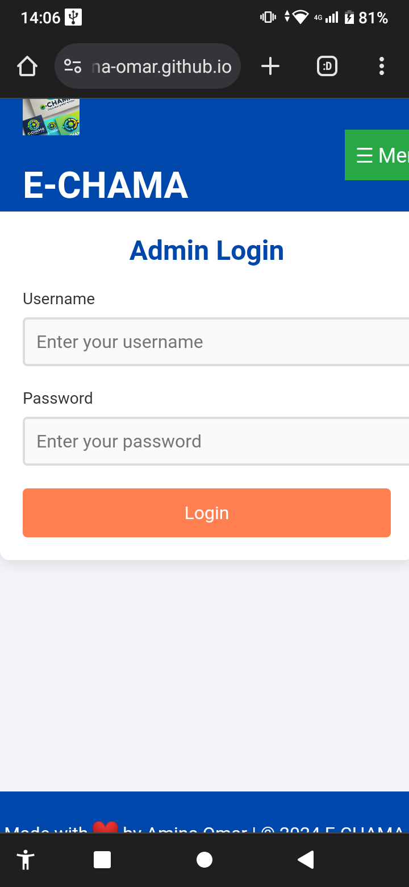

markdown
Copy code
# E-CHAMA Management System

## Overview
E-CHAMA is a management system designed for loan requests and user management. It provides features for user registration, admin login, and loan request submission.

## Table of Contents
- [Prerequisites](#prerequisites)
- [Installation](#installation)
- [Usage](#usage)
- [Screenshots](#screenshots)
- [Contributing](#contributing)
- [License](#license)

## Prerequisites
- [Node.js](https://nodejs.org/en/download/) (v14 or later)
- [MySQL](https://www.mysql.com/downloads/) (v5.7 or later)
- A package manager like npm or yarn

## Installation

1. **Clone the repository:**
   ```bash
   git clone https://github.com/yourusername/e-chama.git
   cd e-chama
Install dependencies:

bash
Copy code
npm install
Set up the MySQL database:

Create a database named e_chama.
Run the following SQL commands to set up the necessary tables:
sql
Copy code
CREATE TABLE admins (
    id INT AUTO_INCREMENT PRIMARY KEY,
    username VARCHAR(255) NOT NULL UNIQUE,
    password VARCHAR(255) NOT NULL
);

CREATE TABLE users (
    id INT AUTO_INCREMENT PRIMARY KEY,
    firstname VARCHAR(255) NOT NULL,
    lastname VARCHAR(255) NOT NULL,
    username VARCHAR(255) NOT NULL UNIQUE,
    email VARCHAR(255) NOT NULL UNIQUE,
    phone VARCHAR(15) NOT NULL,
    password VARCHAR(255) NOT NULL
);

CREATE TABLE loanrequest (
    id INT AUTO_INCREMENT PRIMARY KEY,
    full_name VARCHAR(255) NOT NULL,
    id_number VARCHAR(20) NOT NULL,
    location VARCHAR(255) NOT NULL,
    amount DECIMAL(10,2) NOT NULL,
    repay_period INT NOT NULL
);
Create a .env file:

In the project root, create a file named .env and add the following:
makefile
Copy code
JWT_SECRET=your_jwt_secret
Start the server:

bash
Copy code
npm start
Your server will run on http://localhost:3000.

Usage
Access the application by navigating to http://localhost:3000 in your browser.
You can register users, log in as an admin, and submit loan requests.
Screenshots
Home Page

## Screenshots

### Login Page

### Dashboard

### Admin Login


### User Registration

### contact

Contributing
If you'd like to contribute to this project, please fork the repository and submit a pull request with your changes.

License
This project is licensed under the MIT License - see the LICENSE file for details
